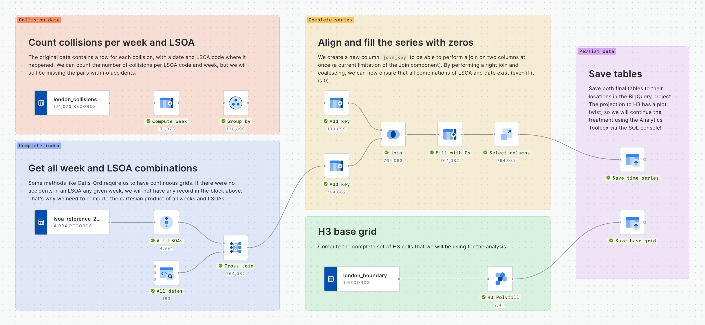

# _Where and When_: A Space-Time Analysis of Vehicle Collisions in London

---

## Presenting the Data

The data we will be using contains information about vehicle collisions in London, during the years 2021 and 2022. It is part of the [public report provided by Transport for London](https://tfl.gov.uk/corporate/publications-and-reports/road-safety#on-this-page-1), which is available online, under the “Road collision data” section.

This data has been uploaded already to BigQuery and enriched with the appropriate boundaries, in order to properly visualize it.

The data comes in two different source tables:

- The **LSOA reference data**, a table that contains the ID and geometry per LSOA and different valuable features like the population that lives in such LSOA or the road km it contains.

[https://clausa.app.carto.com/map/529040c6-bd6a-4ba8-b608-a954aedab2db](https://clausa.app.carto.com/map/529040c6-bd6a-4ba8-b608-a954aedab2db)

- The **collision data** itself, that contains a row per accidents and includes several features related to it as severity, time at which it occurred, and the LSOA where it happened.

[https://clausa.app.carto.com/map/9781d4d4-ea52-49cc-8f12-e1075c9cc12b](https://clausa.app.carto.com/map/9781d4d4-ea52-49cc-8f12-e1075c9cc12b)

## Exploratory Analysis

### Consolidating all data into time series

For this use case, we are not interested to work with the individual collisions, but the aggregate counts per chosen timestamp. Therefore, our first step is to format the data in a single table that counts how many accidents per geographical support (per LSOA) have happened in each time step. We could work with daily data but in this use case it is probably going to be far too sparse - let's aggregate the series in weekly steps instead.

```sql
CREATE OR REPLACE TABLE
  `sdsc-london-2024.spacetime.london_collisions_weekly`
CLUSTER BY week, lsoa_code
AS (
  SELECT
    collision_location_lsoa_code AS lsoa_code,
    DATE_TRUNC(date, WEEK) AS week,
    COUNT(DISTINCT collision_id) AS n_collisions
  FROM
    `sdsc-london-2024.spacetime.london_collisions`
  WHERE
    date BETWEEN '2021-01-01' AND '2023-12-31'
  GROUP BY
    lsoa_code,
    week
);
```

This way, we will now have one row per LSOA and week, that will contain the total number of collisions that have happened in such area. This is, certainly, a step in the right direction!

### Explaining MAUP

This map is, however, a bit misleading. To understand why, let's take a step back and plot the population feature we have in the LSOA source table. Here, we can see the population density of London… Except we cannot. This map does not represent in bolder colors those areas with the most population, because the population that fits in an area is tightly dependent of the zone size, and all these zones are different areas!

[https://clausa.app.carto.com/map/2aea85f3-aaaf-4b5e-a6eb-4ce7a6f12f2a](https://clausa.app.carto.com/map/2aea85f3-aaaf-4b5e-a6eb-4ce7a6f12f2a)

This is called the [Modifiable Areal Unit Problem or MAUP](https://en.wikipedia.org/wiki/Modifiable_areal_unit_problem), and it's a measure bias that we has been introduced when aggregating point data (collisions) to units with different shapes and scales (the LSOA). If we had source data (collisions’ coordinates) we could have fell into it, but this time it came in our source data. It is important to have this in mind, to compensate for this bias.

To have a more true-to-life representation of the population, we could compute the population density: it is not really the same variable anymore (it will be extensive instead of intensive), but for plotting it will be more suitable:

```sql
SELECT
  *,
  population / ST_AREA(geom) * 1e6 AS population_density
FROM
  `sdsc-london-2024.spacetime.lsoa_reference_2021`
```

[https://clausa.app.carto.com/map/c2375760-4833-4447-9472-0ab233528608](https://clausa.app.carto.com/map/c2375760-4833-4447-9472-0ab233528608)

We can see how the representation is night and day, and this visualization does actually represent where most of the population is located in London. Let's try, however, a different approach to work with this data.

## Projecting the Data

### Spatial Indexes

Quoting CARTO's quickstart guide on Spatial Indexes:

> *Spatial Indexes are multi-resolution, hierarchical grids that are “geolocated” by a short reference string, rather than a complex geometry*

Spatial indexes are, therefore, some kind of IDs that always point to the same portion of land. We can also traverse a hierarchy of cells: having the ID of a cell, we can get the parent cell (a larger cell that contains the one we are working with) or the children cell (all the cells that are contained within it).

There are some obvious performance gains using spatial indexes:

- They are much **smaller to store**: they are represented with an integer or a string, so we save having a full geometry in the database.
- They are more **natural for cloud data warehouses**: being an integer or a string, most operations can be run using a `JOIN` or a `GROUP BY` natively.
- They function as a **common ground for all your data**: no need to worry about how to mix your points, lines and geometries; we can almost always project these data to a continuous, deterministic and performant grid structure.

There are two main spatial indexes to take into account, that should cover a vast majority of the use cases:

- **H3**, which provides a hexagonal grid. The main advantage it provides is that, **for each and every cell, all of its neighbor's centroids are at the same distance of its own**. This is by definition of what a regular hexagon is and does not happen in quadrilateral shapes: the North neighbor is closer than the North-East one.
- On the other hand we have **Quadbin**, which provides a quadrangular grid. The advantage it has compared to H3 is that **each of the square cells are exactly subdivided in four children cells**. This is not the case in H3: hexagons cannot be cleanly subdivided in hexagonal children cells; the relation is approximate.

Except very certain use cases, most times it comes down to personal preference or the fact that hexagons look cool in a map. Today, since we are going to later use neighbor rings (K-rings), let's choose H3.

### Enrichment Functions


```sql
SELECT * FROM `sdsc-london-2024.spacetime.london_boundary`
```

All the enrichment functions must receive an input grid that defines which cells are considered a zone of interest for our data. The first step we will be taking is to create an H3 grid of resolution 8 of the whole city of London.

```sql
CREATE OR REPLACE TABLE
  `sdsc-london-2024.spacetime.london_h3_8`
CLUSTER BY h3
AS (
  SELECT
    h3
  FROM
    UNNEST (
      `carto-un`.carto.H3_POLYFILL(
        (
          SELECT geom
          FROM `sdsc-london-2024.spacetime.london_boundary`
        ),
        8
      )
    ) AS h3
)
```

### Quick intermission…

What if I told you that we could have done everything up to this point of the workshop without writing a single line of SQL?



This screenshot shows how we have done everything up to this point using [a Workflow](https://clausa.app.carto.com/workflows/abe6cf47-958b-41dc-afe3-64304b3bb1f7), part of CARTO’s no-code / low-code solution. Some advantages of using Workflows instead of SQL is that we can have a single query doing everything without worrying of temporal tables (Workflows takes care of that) and provides a more natural way to link together the different steps: you will understand later once we start using some of the AT’s functions that the nested queries become harder to grasp without previous experience using it.

Unfortunately, we cannot do the complete workshop in Workflows yet: our product team is working hard on having full coverage of the Analytic Toolbox as Workflows components, but we are not there yet. However, the current intention is **having a component for each and every function released on the AT**.

Now that we have our base grid, we can start projecting the data to it. Let's first start with all the variables that have no time dimension, so we can better understand what’s going on.

The `ENRICH_GRID` function is one of the many data functions available in the Analytics Toolbox that does exactly what we need in this moment. 

```sql
CALL `carto-un`.carto.ENRICH_GRID(
  'h3',
  'SELECT * FROM `sdsc-london-2024.spacetime.london_h3_8`',
  'h3',
  'SELECT * FROM `sdsc-london-2024.spacetime.lsoa_reference_2021`',
  'geom',
  [('population', 'sum')],
  ['`sdsc-london-2024.spacetime.london_lsoa_enrich_population_h3`']
);
```

[https://clausa.app.carto.com/map/f5689fc9-c7a2-4f11-aa55-e46e13f77dcd](https://clausa.app.carto.com/map/f5689fc9-c7a2-4f11-aa55-e46e13f77dcd)

Here we can see how the visual representation is so much different using H3. This is because thanks to the aerial distribution we are making, we are compensating for the MAUP, by projecting the data into equally-sized portions of land. This is a true-to-life, first-glance map of the London population density.

There is, however, another thing to take into account: these enrichment functions have been developed (at least by now) with a geographical intent in mind. We cannot use them as-is to enrich a grid and keep our time-series structure; we would lose our date column by calling the `ENRICH_GRID` function, since it will keep a single row per H3.

To overcome this, we will be using the advanced function that the Analytics Toolbox provides: `ENRICH_GRID_RAW`. This function works very similar to `ENRICH_GRID`, but will return partial results: instead of deciding an aggregation function (like the `sum` for `population` above), it will return all the pairs of H3 cells along with an array of SQL `struct` elements, one per intersecting LSOA, including both the features we ask to and a collection of useful statistics.

Using this, we can define a weight mapping to translate LSOA ids to H3, while keeping the data (since we are going to be doing the grouping, we can choose multiple indexes).

```sql
CALL `carto-un`.carto.ENRICH_GRID_RAW(
  'h3',
  'SELECT * FROM `sdsc-london-2024.spacetime.london_h3_8`',
  'h3',
  'SELECT * FROM `sdsc-london-2024.spacetime.lsoa_reference_2021`',
  'geom',
  ['id', 'population', 'road_length'],
  ['`sdsc-london-2024.spacetime.london_lsoa_enrich_raw_h3`']
);
```

The results of this query include the following columns:

- `h3`, which is the H3 cell ID;
- `__carto_enrichment`, an `ARRAY` containing one element per intersecting LSOA, with:
    - `id`, the LSOA ID;
    - `population`, the LSOA’s total population;
    - `road_length`, the LSOA’s total road length;
    - `__carto_total`, the LSOA’s total area;
    - `__carto_intersection`, the area of the intersection between the H3 and the LSOA.

With all these features, we can run the following query, to proportionally distribute the accidents of each LSOA between the associated H3 cells manually.

```sql
CREATE OR REPLACE TABLE
  `sdsc-london-2024.spacetime.london_collisions_weekly_h3`
CLUSTER BY week, h3
AS (
  WITH
    geo_pairs AS (
      SELECT 
        h3,
        enrichment.id AS lsoa_code,
        enrichment.__carto_total AS total_area,
        enrichment.__carto_intersection AS intersection,
      FROM 
        `sdsc-london-2024.spacetime.london_lsoa_enrich_raw_h3`,
        UNNEST (__carto_enrichment) AS enrichment
    )
  SELECT
    h3,
    week,
    SUM(n_collisions * (intersection / total_area)) AS n_collisions,
  FROM
    `sdsc-london-2024.spacetime.london_collisions_weekly`
  LEFT JOIN
    geo_pairs
    USING (lsoa_code)
  GROUP BY
    h3, week
  HAVING
    h3 IS NOT NULL
);
```

[https://clausa.app.carto.com/map/e6be2061-25af-4a3f-8700-f1aaf3aabedc](https://clausa.app.carto.com/map/e6be2061-25af-4a3f-8700-f1aaf3aabedc)

Now we have projected the data into H3, but it is important to understand that this way we don’t really have "accidents” anymore: instead, we have something closer to the “probability of an accident”: since we don't have the location of the accident but the LSOA, in case an LSOA spans across 4 different H3 cells, each of them will receive 0.25 accidents. This is a weird measurement, especially if we were to show this in a dashboard to end users, but it is perfectly fine for the analysis that we are going to perform (and some of them will even compensate a bit for it).

## Spatial Insights

### Local Moran’s *I*

Even though the main focus of the workshop is to focus on the space-time functions, let's first run a spatial-only analysis that will provide very valuable insights for the use case and that will be a very nice complement to the rest of the work we will be doing.

Local Moran's $I$ is a cluster and outlier analysis that will provide information on how a cell relates with its surroundings. In this use case, it will help us find outliers with high concentration of accidents in areas where that is not common.

To run the analysis, we can run the following query using the `LOCAL_MORANS_I_H3_TABLE` from the Analytics Toolbox:

```sql
CALL `carto-un`.carto.LOCAL_MORANS_I_H3_TABLE(
  '''
    SELECT h3, SUM(n_collisions) AS n_collisions
    FROM `sdsc-london-2024.spacetime.london_collisions_weekly_h3`
    GROUP BY h3
  ''',
  'sdsc-london-2024.spacetime.london_collisions_weekly_h3_lmi',
  'h3',
  'n_collisions',
  2,
  'inverse',
  100
);

CREATE OR REPLACE TABLE
  `sdsc-london-2024.spacetime.london_collisions_weekly_h3_quads`
CLUSTER BY h3
AS (
  SELECT
    index AS h3,
    value AS spatial_autocorrelation,
    psim AS p_value,
    CASE
      WHEN quad = 1 THEN 'HH'
      WHEN quad = 2 THEN 'LL'
      WHEN quad = 3 THEN 'LH'
      WHEN quad = 4 THEN 'HL'
    END AS quad
  FROM
    `sdsc-london-2024.spacetime.london_collisions_weekly_h3_lmi`
  WHERE
    psim < 0.05
)
```

After running the procedure, we filter only those cells where we have a significant measure and make the `quad` feature more explicit:

- `LL` means that is a cell with low value surrounded by low-valued cells,
- `HH` means that is a cell with high value surrounded by high-valued cells,
- `LH` means that is a cell with low value surrounded by high-valued cells,
- `HL` means that is a cell with high value surrounded by low-valued cells.

Therefore, both `LH` and `HL` are geospatial outliers, but the most interesting ones are `HL` cells: those cells that concentrate a lot of collisions without the surroundings doing the same imply that they have an anomalously high value that is probably not explained by more vehicles passing by.

[https://clausa.app.carto.com/map/33bbee6c-2329-48ec-9f55-3a764339a39e](https://clausa.app.carto.com/map/33bbee6c-2329-48ec-9f55-3a764339a39e)

## Space-time Insights

### Space-time Getis-Ord

Getis-Ord is a family of statistics used to perform hot spot analysis: measure of value and how it correlates with its surroundings. The higher the value of the metric to measure in a cell, as well as the surrounding cells, using a convolution kernel. This way, we have a better insight on what are the dynamics from a geographical point of view.

Space-time Getis-Ord iterates on this same concept, but adding time as a new dimension: now, the surroundings of a cell are not only its neighbors, but also the adjacent time steps (those same neighbors $N$ time steps before and after). If we had a 2D kernel before, now it is 3D.

```sql
CALL `carto-un`.carto.GETIS_ORD_SPACETIME_H3_TABLE(
  'sdsc-london-2024.spacetime.london_collisions_weekly_h3',
  'sdsc-london-2024.spacetime.london_collisions_weekly_h3_gi',
  'h3',
  'week',
  'n_collisions',
  3,
  'WEEK',
  1,
  'gaussian',
  'gaussian'
);
```

This function will return a table with the following columns:

- `index`, the spatial index;
- `date`, the time column;
- `gi`, the $G_i^*$ metric for the given cell and time step (the “temperature”);
- `p_value`, the $p$ value of the statistic.

By performing this statistic, we can now check how different parts of the city become “hotter” or “colder” as time progresses. This is already insightful, but we have two more functions still that will help us extract more knowledge of this result.

[https://clausa.app.carto.com/map/6cff259c-1ea9-44ad-aa75-e20364031966](https://clausa.app.carto.com/map/6cff259c-1ea9-44ad-aa75-e20364031966)

### Time Series Clustering

In the Analytics Toolbox, as part of these new space-time initiatives, we have made available a function that we expect to develop further in the future called `TIME_SERIES_CLUSTERING`, that allows to generate $N$ clusters of time series, using different clustering methods. Right now, it features two very simple approaches:

- Value characteristic, that will cluster the series based on the step-by-step distance of its values (the closer the signals, the closer the series);
- Profile characteristic, that will cluster the series based on their dynamics along the time span passed (the closer the correlation, the closer the series).

It can be tricky to cluster the series as-is, but now that we have smoothed the signal using the space-time Getis-Ord, we could try to cluster the cells based on the resulting temperature. We will take only into account those cells that have at least 75% of their observations with reasonable significance.

```sql
CALL `cartodb-on-gcp-datascience.dvicente_at_carto.TIME_SERIES_CLUSTERING`(
  '''
    SELECT * FROM `sdsc-london-2024.spacetime.london_collisions_weekly_h3_gi`
    QUALIFY PERCENTILE_CONT(p_value, 0.6) OVER (PARTITION BY index) < 0.05
  ''',
  'index',
  'date',
  'gi',
  'sdsc-london-2024.spacetime.london_collisions_weekly_h3_clusters',
  JSON '{ "method": "profile", "n_clusters": 4 }'
);
```

Even if it can feel like some layers of indirection, this has several advantages:

- Since it has been temporally smoothed, noise has been reduced in the dynamics of the series;
- Since it has been geographically smoothed, clusters are easier to be done using contiguous cells;
- By using neighboring cells data, we are compensating for possible errors in projecting the data from LSOA to H3.

In this map shows the different clusters that are returned as a result:

[https://clausa.app.carto.com/map/a91bd3c2-dcd1-44a8-8f09-25a1347b4d22](https://clausa.app.carto.com/map/a91bd3c2-dcd1-44a8-8f09-25a1347b4d22)

We can immediately see the different dynamics in the widget:

- There are two clusters that group high-concentration cells (#2 and #4) and two more for the lower values.
- In the higher valued clusters, we can see a divergence in the number of collisions: while both clusters had a similar 2021, the areas in the #2 cluster had much less collisions during 2022.
- In the lower valued ones, the #1 cluster features several spikes in winter that could he worth looking into.

### Emerging Hotspots

There is yet another analysis we can apply to the space-time Getis-Ord results, that will digest the results into a single map based on several pre-defined categories. In the future, these will be gathered in the documentation, and even though they are subject to change, this a quick summary of the categories that can be classified:

<!-- TODO: Include a table with the final categories -->

We can run the analysis with a function call using the Getis-Ord results:

```sql
CALL `cartodb-on-gcp-datascience.dvicente_at_carto.SPACETIME_HOTSPOTS_CLASSIFICATION_TABLE`(
  'sdsc-london-2024.spacetime.london_collisions_weekly_h3_gi',
  'sdsc-london-2024.spacetime.london_collisions_hotspot_classification',
  'index',
  'date',
  'gi',
  'p_value',
  '{"threshold": 0.05, "algorithm": "mmk"}'
);
```

[https://clausa.app.carto.com/map/9ece5353-7dfe-4ed1-8230-063c0b5cd2b0](https://clausa.app.carto.com/map/9ece5353-7dfe-4ed1-8230-063c0b5cd2b0)

We can see how now we have the different types of behaviors at a glance in a single map. There are several insights we can extract from this map:

- There is an amplifying hotspot in the city center that shows an upward trend in collisions.
- The surroundings of that amplifying hotspot are mostly intermittent.
- The periphery of the city is mostly cold spots, but most of them are fluctuating, intermittent or even waning.

